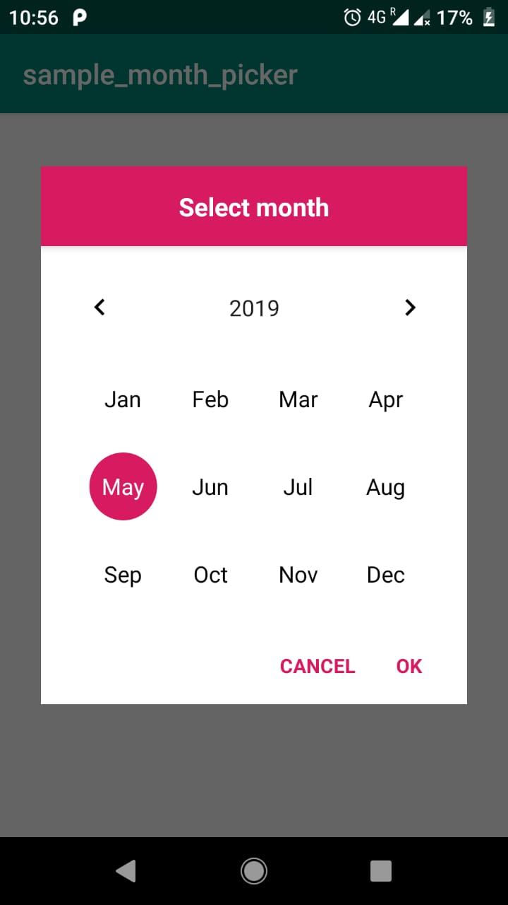
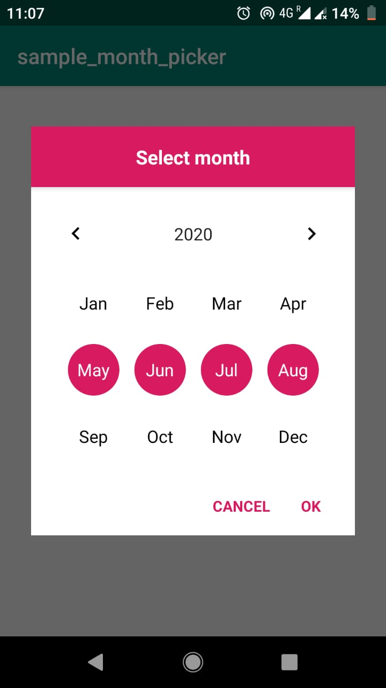

# EasyMonthPicker-android
EasyMonthPicker :- A android library helps you to select one or more month(s) and number of days in that month.

[](https://jitpack.io/#hvyas3662/EasyMonthPicker-android)

<div width="100%">
  
  
</div>

## How to configure

 For a working implementation, please have a look at the app directory
 1. Add maven in your root build.gradle

```gradle
allprojects {
  repositories {
    maven { url 'https://jitpack.io' }
  }
}
```
 2. Add the dependency in your app level build.gradle
 ```gradle
dependencies {
  implementation 'com.github.hvyas3662:EasyMonthPicker-android:2.0'
}
```

## How do I use EasyMonthPicker?

  ```java
      new EasyMonthPicker(this)
        .setTitleText("Month Picker")
        .setTitleTextColor(R.color.black)
        .setYearWidgetColor(R.color.white)
        .setPositiveButtonText("Select")
        .setNegativeButtonText("Dismiss")
        .setSelectedYear(2024)
        .setSelectedMonth(EasyMonthPicker.FEB)
        .isCancelable(true)
        .setDialogBgColor(R.color.colorRed)
        .setDialogPrimaryColor(R.color.white)
        .setSelectedUnselectedMonthTextColor(R.color.white,R.color.black)
        .setYearTextAppearance(R.style.tp)
        .setMonthTextAppearance(R.style.tp,R.style.tp1)
        .setNextPreviousYearButtonDrawable(R.drawable.ic_arrow_forward_black_24dp,R.drawable.ic_arrow_back_black_24dp)
        .setOnMonthSelectListener(new OnMonthSelectListener(){
@Override
public void onPositiveButtonClicked(MonthPickerResult result){
        Log.d("year",result.getYear()+"");
        Log.d("month_name",result.getSelectedMonthName());
        Log.d("month_name_short",result.getSelectedMonthShortName());
        Log.d("selectedMonthIndex",result.getSelectedMonthIndex()+"");
        Log.d("EndDate",result.getSelectedMonthEndDate()+"");
        }

@Override
public void onNegativeButtonClicked(){

        }
        })
        .show();
  ```

## Other methods

Below written each method return EasyMonthPicker class current instance for method chaining.

| Methods | Description |
| --- | --- |
| `EasyMonthPicker(Context context)` | Take activity context in argument and init builder class  |
| `setTitleText(String title)` | Set the dialog title text |
| `setSelectedYear(int year)` | set selected year | 
| `setPositiveButtonText(String text)` | Set positive button text | 
| `setNegativeButtonText(String text)` | Set negative button text |
| `setSelectedMonth(int monthIndex)` | Set selected month index | 
| `isCancelable(boolean cancelable)` | Set dialog cancelable flag | 
| `setMultiSelect(int limit, ArrayList<Integer> monthIndexList)` | Enable multi select 1 st Arg: max no of selection and 2nd Arg list of selected month index  | 
| `setNextPreviousYearButtonDrawable(@DrawableRes int nextButtonDrawable, @DrawableRes int previousButtonDrawable)` | Set the Drawable of next, previous year buttons, required drawable resource id in argument |
| `setTitleTextColor(@ColorRes int titleTextColor)` |  Set the dialog title text color |
| `setSelectedUnselectedMonthTextColor(@ColorRes int unselectedColor, @ColorRes int selectedColor)` | Set selected and un selected month text color  |
| `setDialogBgColor(@ColorRes int bgColor)` | Set dialog background color also include bottom action bar | 
| `setDialogPrimaryColor(@ColorRes int color)` | Set dialog primery color which effect, title bg, selected month bg, and text color of action buttons |
| `setYearWidgetColor(@ColorRes int color)` | Set color of year widgit which effect tint of next previous year button tint and year text color |
| `setMonthBgSelector(@DrawableRes int monthBgSelector)` | Set custom selected unselected state list drawable note: if we use custom monthBg Drawable then dialog primary color will not work on it | 
| `setMonthTextAppearance(@StyleRes int unSelected, @StyleRes int selected)` |  Set selected and unSelected state month TextAppearance | 
| `setYearTextAppearance(@StyleRes int id)` | Set Year TextAppearance |
| `setOnMonthMultiSelectListener(OnMonthMultiSelectListener multiSelectListener)` | Set listener of multi select | 
| `setOnMonthSelectListener(OnMonthSelectListener monthSelectListener)` | Set listener for single select | 
| `setOnMonthPickerDismissListener(OnMonthPickerDismissListener dismissListener)` | Set listener of dismiss event |
| `setLocale(Locale locale)` | Set Locale | 
| `show()` | Show the dialog |
| `dismiss()` | Dismiss the dialog |

## Compatibility

* Requires minimum android API 21 or above
